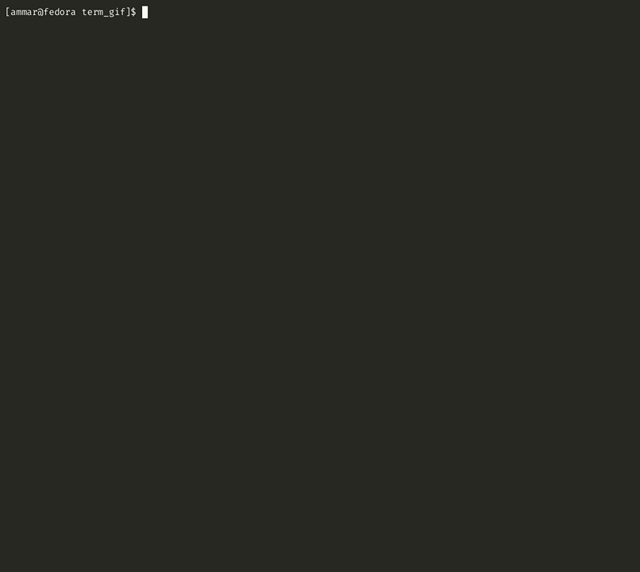

<!----------------------------------------------------------------------------->

[ci]:  https://github.com/AmmarAbouZor/tui-journal/workflows/CI/badge.svg
[ci-url]:  https://github.com/AmmarAbouZor/tui-journal/workflows/CI
[crates-io]:  https://img.shields.io/crates/v/tui-journal
[crates-io-url]:  https://crates.io/crates/tui-journal
[docs-rs]:  https://docs.rs/tui-journal/badge.svg
[docs-rs-url]:  https://docs.rs/tui-journal
[downloads]:  https://img.shields.io/crates/d/tui-journal
[lcns]:  https://img.shields.io/github/license/AmmarAbouZor/tui-journal
[lst]:  https://img.shields.io/github/last-commit/AmmarAbouZor/tui-journal
[repository]:  https://github.com/AmmarAbouZor/tui-journal

<!----------------------------------------------------------------------------->

# TUI-Journal

[![][ci]][ci-url]
[![][crates-io]][crates-io-url]
[![][docs-rs]][docs-rs-url]
[![][downloads]][crates-io-url]
[![][lst]][repository]
[![][lcns]][repository]

TUI-Journal is a terminal-based application written in Rust that allows you to write and manage your journal/notes from within the comfort of your terminal. It provides a simple and efficient interface for creating and organizing your thoughts, ideas, and reflections. TUI-Journal supports two different local back-ends: a plain text back-end in JSON format and a database back-end using SQLite. 

## Demo



## Features

- Write and manage journal/notes entries from the terminal.
- Store your entries in either a plain text file using the JSON format or a SQLite database.
- Intuitive, responsive and user-friendly text-based user interface (TUI).
- Create, edit, and delete entries easily.
- Keybindigs is a combination of VIM and Emacs motions (VIM for navigation and Emacs for editing texts in edit-mode).
- See the keybindings from inside the app
- Cross-platform compatibility (Windows, macOS, Linux, NetBSD).

## Roadmap

#### Back-ends:
- [x]  Plain text JSON back-end.
- [x]  Database back-end using SQLite.
- [ ]  RESTful back-end server with a client in the app.
#### Application:
- [ ]  Customize themes and keybindings.
- [ ]  Search functionality.
- [ ]  Load entries as chunks for better performance.
## Installation

Ensure you have [Rust](https://www.rust-lang.org/tools/install) installed on your system.

#### Linux Dependencies:

Make sure the OpenSSL development package is installed on your system.

- Ubuntu/Debian:
   ```bash
   sudo apt install -y libssl-dev 
   ```
- Fedora:
    ```bash
    sudo dnf install openssl-devel
    ```

#### Install with default features:


To install TUI-Journal with default features (SQLite and JSON), you can use `cargo` to install directly from [crates.io](https://crates.io/crates/tui-journal):

```bash
cargo install tui-journal
```


#### Install with Specific Features:

You can choose to install TUI-Journal with specific features enabled or disabled by customizing the cargo installation command. To install TUI-Journal with only the JSON back-end feature, use the following command:

```bash
cargo install tui-journal --no-default-features --features json
```

To install TUI-Journal with only the SQLite back-end feature, use the following command:

```bash
cargo install tui-journal --no-default-features --features sqlite
```

### NetBSD

On NetBSD a pre-compiled binary built with default features is available from the official repositories. To install it, simply run:

```bash
pkgin install tui-journal
```
    
## Usage

Once installed, you can run TUI-Journal by typing `tjournal` in your terminal:

```bash
$ tjournal
```

To view the available arguments and commands, you can use the `--help` or `-h` flag:

```bash
$ tjournal --help

Usage: tjournal [OPTIONS] [COMMAND]

Commands:
  print-config  Print the current settings including the paths for the backend files [aliases: pc]
  help          Print this message or the help of the given subcommand(s)

Options:
  -j, --json-file-path <FILE PATH>    Sets the entries Json file path and starts using it
  -s, --sqlite-file-path <FILE PATH>  Sets the entries sqlite file path and starts using it
  -b, --backend-type <BACKEND_TYPE>   Sets the backend type and starts using it [possible values: json, sqlite]
  -w, --write-config                  write the current settings to config file (this will rewrite the whole config file)
  -v, --verbose...                    Increases logging verbosity each use for up to 3 times
  -l, --log <FILE PATH>               Specifies a file to use for logging
                                      (default file: <cache_dir>/tui-journal/tui-journal.log)
  -h, --help                          Print help
  -V, --version                       Print version
```

## Configuration

The configuration for TUI-Journal can be found in the `config.toml` file located in the configuration folder within the TUI-Journal directory.

Here is a sample of the default settings in the `config.toml` file:

```toml
backend_type = "Sqlite"

[json_backend]
file_path = "<Documents-folder>/tui-journal/entries.json"

[sqlite_backend]
file_path = "<Documents-folder>/tui-journal/entries.db"
```

## Acknowledgments

TUI-Journal would not have been possible without the following open-source crates:

- [tui-rs](https://crates.io/crates/tui-rs) and its revival [ratatui](https://github.com/tui-rs-revival/ratatui): TUI-Journal utilizes the `tui-rs` and `ratatui` crates, which provide a framework for building terminal user interfaces in Rust. They offer a wide range of components and utilities to create interactive and responsive TUI applications.

- [tui-texteditor](https://crates.io/crates/tui-texteditor): TUI-Journal leverages the `tui-texteditor` crate, which offers a text editor widget specifically designed for terminal-based applications. It provides functionalities such as text manipulation, cursor movement, and scrolling within the TUI environment.

- [sqlx](https://crates.io/crates/sqlx): TUI-Journal benefits from the `sqlx` crate, which is a Rust library for interacting with databases. It enables seamless integration with SQLite, allowing TUI-Journal to store journal entries and notes in a reliable and efficient manner.

These crates have greatly contributed to the development of TUI-Journal, and the project extends its gratitude to the maintainers and contributors of these fantastic open-source libraries.
## Contributing

As the author of TUI-Journal and being new to the open-source community, I would greatly appreciate any contributions from experienced developers. Your contributions can help enhance the functionality, usability, and overall quality of TUI-Journal.

If you have any ideas, bug reports, or feature requests, please don't hesitate to open an issue on the [TUI-Journal](https://github.com/ammarabouzor/tui-journal/issues). Your feedback and input are invaluable in improving the application.

If you would like to contribute code, documentation, or any other form of assistance, I am open to collaboration. Please reach out through the GitHub repository and let's discuss how you can contribute to TUI-Journal.

Thank you for considering contributing to TUI-Journal. Your support is highly appreciated!
## License

[MIT](https://choosealicense.com/licenses/mit/)

