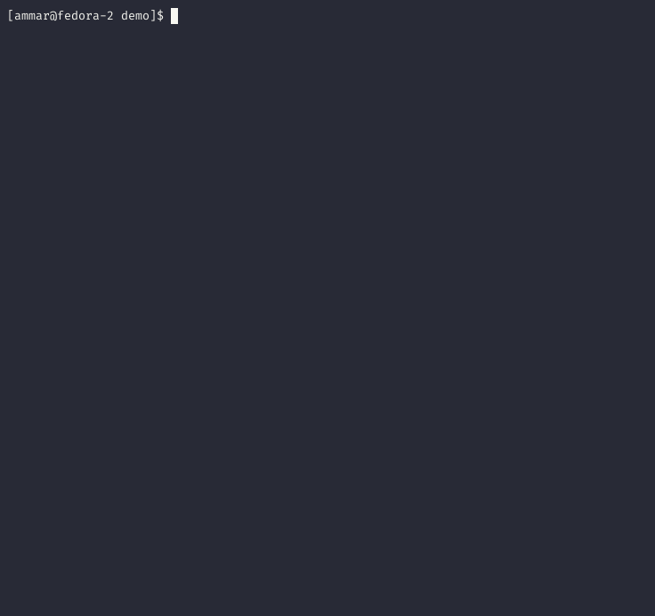

<!----------------------------------------------------------------------------->

[ci]:  https://github.com/AmmarAbouZor/tui-journal/workflows/CI/badge.svg
[ci-url]:  https://github.com/AmmarAbouZor/tui-journal/workflows/CI
[crates-io]:  https://img.shields.io/crates/v/tui-journal
[crates-io-url]:  https://crates.io/crates/tui-journal
[docs-rs]:  https://docs.rs/tui-journal/badge.svg
[docs-rs-url]:  https://docs.rs/tui-journal
[downloads]:  https://img.shields.io/crates/d/tui-journal
[lcns]:  https://img.shields.io/github/license/AmmarAbouZor/tui-journal
[lst]:  https://img.shields.io/github/last-commit/AmmarAbouZor/tui-journal
[repository]:  https://github.com/AmmarAbouZor/tui-journal

<!----------------------------------------------------------------------------->

# TUI-Journal

[![][ci]][ci-url]
[![][crates-io]][crates-io-url]
[![][docs-rs]][docs-rs-url]
[![][downloads]][crates-io-url]
[![][lst]][repository]
[![][lcns]][repository]

TUI-Journal is a terminal-based application written in Rust that allows you to write and manage your journal/notes from within the comfort of your terminal. It provides a simple and efficient interface for creating and organizing your thoughts, ideas, and reflections. TUI-Journal supports two different local back-ends: a plain text back-end in JSON format and a database back-end using SQLite. 

## Demo
<p align="center">
   
</p>

<details>
  <summary><h3>Fuzzy Finder</h3></summary>
  
<p align="center">
   
</p>

</details>

## Table of Contents

- [Features](#features)
- [Roadmap](#roadmap)
- [Installation](#installation)
  - [Arch Linux](#arch-linux)
  - [Alpine Linux](#alpine-linux)
  - [NetBSD](#netbsd)
  - [Build & Install via Cargo ](#build--install-via-cargo)
- [Usage](#usage)
- [Configuration](#configuration)
- [Documentation](#documentation)
- [Acknowledgments](#acknowledgments)
- [Contributing](#contributing)
- [License](#license)

## Features

- Write and manage journal/notes entries from the terminal.
- Store your entries in either a plain text file using the JSON format or a SQLite database.
- Intuitive, responsive and user-friendly text-based user interface (TUI).
- Create, edit, and delete entries easily.
- Edit journal content with the built-in editor or use your favourite terminal text editor from within the app.
- Add custom colored tags to the journals and use them in the built-in filter.
- Fuzzy Finder: Locate your desired journal with lightning-fast speed.
- Search functions for journals title and content in the built-in filter.
- Sort the journals based on their date, priority and title.
- Control many journals at once via the multi-select mode
- History management with Undo and Redo actions to easily revert or reapply changes in your entries
- Keybindings is a combination of VIM and Emacs motions (VIM for navigation and Emacs for editing texts in edit-mode).
- Utilize Editor's Visual Mode for VIM-style text selection, copying, and deletion.
- Export and Import journals between different back-end files.
- Export the current journal's content to a predefined export path or the current directory 
- Transfer text between the built-in editor and the system clipboard using Cut, Copy, and Paste.
- Optionally sync the clipboard between the built-in editor and the operating system, with vim and emacs keybindings.
- Sorting and full-screen preferences in the App State will be retained.
- See the keybindings from inside the app
- Cross-platform compatibility (Windows, macOS, Linux, NetBSD).

## Roadmap

#### Back-ends:
- [x]  Plain text JSON back-end.
- [x]  Database back-end using SQLite.
- [ ]  RESTful back-end server with a client in the app.
#### Application:
- [x]  Edit journals content with external text editor from within the app.
- [x]  Filter & Search functionalities.
- [ ]  Add mouse support
- [ ]  Preview mode for journals supporting Mark Down highlighting and word wrapping.
- [ ]  Improve app input and rending cycle using app events to support real concurrency within the app.
- [ ]  Customize themes and keybindings.

      
## Installation

Grab the most recent pre-built binaries for your platform from the [Releases page](https://github.com/AmmarAbouZor/tui-journal/releases), or utilize the available package managers.

### Arch Linux

On Arch Linux, you can install TUI-Journal by using [pacman](https://wiki.archlinux.org/title/Pacman):

```bash
pacman -S tui-journal
```

### Alpine Linux

TUI-Journal is available for [Alpine Edge](https://pkgs.alpinelinux.org/packages?name=tui-journal&branch=edge). It can be installed via [apk](https://wiki.alpinelinux.org/wiki/Alpine_Package_Keeper) after enabling the [testing repository](https://wiki.alpinelinux.org/wiki/Repositories).

```bash
apk add tui-journal
```

### NetBSD

On NetBSD a pre-compiled binary built with default features is available from the official repositories. To install it, simply run:

```bash
pkgin install tui-journal
```

### Build & Install via Cargo 

Ensure you have [Rust](https://www.rust-lang.org/tools/install) installed on your system.

The minimum required Rust version is `1.75.0` 

#### Linux Dependencies:

Make sure the OpenSSL development package is installed on your system.

- Ubuntu/Debian:
   ```bash
   sudo apt install -y libssl-dev 
   ```
- Fedora:
    ```bash
    sudo dnf install openssl-devel
    ```

#### Install with default features:


To install TUI-Journal with default features (SQLite and JSON), you can use `cargo` to install directly from [crates.io](https://crates.io/crates/tui-journal):

```bash
cargo install tui-journal --locked
```

#### Install nightly version:
To use the current nightly version, you can install it directly from the GitHub repository

```bash
cargo install --git https://github.com/ammarabouzor/tui-journal
```

#### Install with Specific Features:

You can choose to install TUI-Journal with specific features enabled or disabled by customizing the cargo installation command. To install TUI-Journal with only the JSON back-end feature, use the following command:

```bash
cargo install tui-journal --locked --no-default-features --features json
```

To install TUI-Journal with only the SQLite back-end feature, use the following command:

```bash
cargo install tui-journal --locked --no-default-features --features sqlite
```

## Usage

Once installed, you can run TUI-Journal by typing `tjournal` in your terminal:

```bash
$ tjournal
```

To view the available arguments and commands, you can use the `--help` or `-h` flag:

```bash
$ tjournal --help

Usage: tjournal [OPTIONS] [COMMAND]

Commands:
  print-config  Print the current settings including the paths for the backend files [aliases: pc]
  import-journals  Import journals from the given transfer JSON file to the current back-end file [aliases: imj]
  assign-priority  Assign priority for all the entires with empty priority field [aliases: ap]
  help          Print this message or the help of the given subcommand(s)

Options:
  -j, --json-file-path <FILE PATH>    Sets the entries Json file path and starts using it
  -s, --sqlite-file-path <FILE PATH>  Sets the entries sqlite file path and starts using it
  -b, --backend-type <BACKEND_TYPE>   Sets the backend type and starts using it [possible values: json, sqlite]
  -w, --write-config                  write the current settings to config file (this will rewrite the whole config file)
  -v, --verbose...                    Increases logging verbosity each use for up to 3 times
  -l, --log <FILE PATH>               Specifies a file to use for logging
                                      (default file: <cache_dir>/tui-journal/tui-journal.log)
  -h, --help                          Print help
  -V, --version                       Print version
```

## Configuration

The configuration for TUI-Journal can be found in the `config.toml` file located in the configuration folder within the TUI-Journal directory.

Here is a sample of the settings in the `config.toml` file:

```toml
backend_type = "Sqlite"   # Available options: Json, Sqlite. Default value: Sqlite.

default_journal_priority = 3  # Sets the suggested priority while creating a new journal

scroll_per_page = 5  # Sets how many journals will be scrolled when using page up/down commands

sync_os_clipboard = false  # Syncs editor clipboard actions with operating system clipboard 

history_limit = 10  # Sets the maximum changes limit for the undo & redo stacks. Use 0 to disable it.

colored_tags = true   # Sets if automatically coloring for tags is enabled.

[export]
default_path = "<Absolute_path_to_export_directory>"   # Optional default path to export multiple journals or a single journal's content. Falls back to the current directory if not specified.
show_confirmation = true   # Show confirmation after successful export.
scroll_per_page = 5    # Sets how many journals will be scrolled using Page-Up and Page-Down command

[external_editor]
# Set the external terminal editor to use from within the app.
# If the value isn't set the app will try to retrieve the editor from git global configurations then It'll try with the environment variables VISUAL, EDITOR then it'll fallback to vi.  
command = "nvim"
# Enabling this save the journal content automatically after closing the external editor
auto_save = false

# Note: external_editor can still be configured in one line to set the command. In that case, the default values for the other fields will be used
# external_editor = "nvim"

[json_backend]
file_path = "<Documents-folder>/tui-journal/entries.json"

[sqlite_backend]
file_path = "<Documents-folder>/tui-journal/entries.db"
```

## Documentation

For detailed information about the TUI Journal app, including usage guide, keymaps, and configuration details, please refer to the [Wiki](https://github.com/AmmarAbouZor/tui-journal/wiki).


## Acknowledgments

TUI-Journal would not have been possible without the following open-source crates:

- [tui-rs](https://crates.io/crates/tui-rs) and its revival [ratatui](https://github.com/tui-rs-revival/ratatui): TUI-Journal utilizes the `tui-rs` and `ratatui` crates, which provide a framework for building terminal user interfaces in Rust. They offer a wide range of components and utilities to create interactive and responsive TUI applications.

- [tui-texteditor](https://crates.io/crates/tui-texteditor): TUI-Journal leverages the `tui-texteditor` crate, which offers a text editor widget specifically designed for terminal-based applications. It provides functionalities such as text manipulation, cursor movement, and scrolling within the TUI environment.

- [sqlx](https://crates.io/crates/sqlx): TUI-Journal benefits from the `sqlx` crate, which is a Rust library for interacting with databases. It enables seamless integration with SQLite, allowing TUI-Journal to store journal entries and notes in a reliable and efficient manner.

These crates have greatly contributed to the development of TUI-Journal, and the project extends its gratitude to the maintainers and contributors of these fantastic open-source libraries.
## Contributing

As the author of TUI-Journal and being new to the open-source community, I would greatly appreciate any contributions from experienced developers. Your contributions can help enhance the functionality, usability, and overall quality of TUI-Journal.

If you have any ideas, bug reports, or feature requests, please don't hesitate to open an issue on the [TUI-Journal](https://github.com/ammarabouzor/tui-journal/issues). Your feedback and input are invaluable in improving the application.

If you would like to contribute code, documentation, or any other form of assistance, I am open to collaboration. Please reach out through the GitHub repository and let's discuss how you can contribute to TUI-Journal.

Thank you for considering contributing to TUI-Journal. Your support is highly appreciated!
## License

[MIT](https://choosealicense.com/licenses/mit/)

